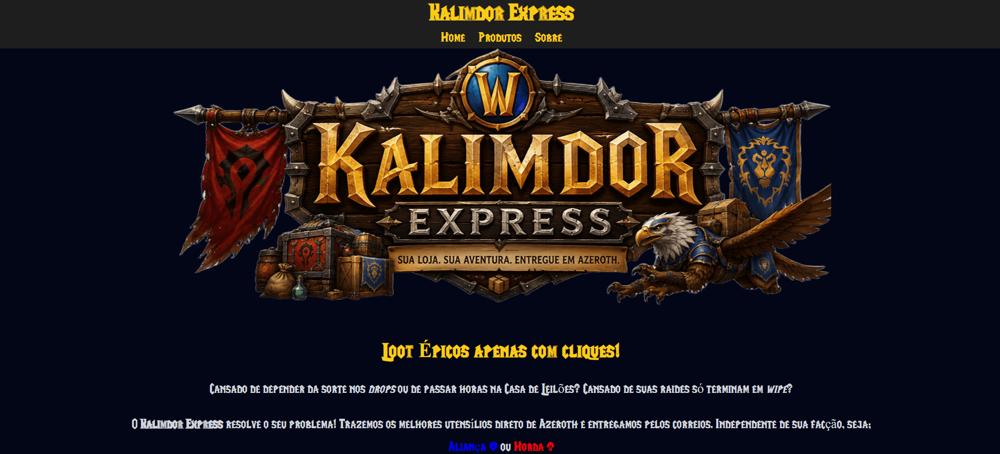

# ⚔️ Kalimdor Express


O **Kalimdor Express** é um projeto de site básico, desenvolvido com HTML e CSS, com o objetivo de apresentar uma identidade visual inspirada em elementos do jogo *World of Warcraft*, da empresa Blizzard. A proposta do projeto é criar uma página inicial (home) simples.

> A estrutura do site foi pensada para ser simples, facilitando tanto a navegação do usuário quanto o aprendizado no desenvolvimento front-end. A página principal contém um cabeçalho com menu de navegação, um banner visual, uma seção de destaque com frase temática, apresentação de produtos e uma breve descrição sobre o projeto.

*Modelo de loja virtual simples, utilizando o básico de HTML e CSS para a construção. A página é inspirada no universo do jogo World of Warcraft, da Blizzard. Exemplos de itens à venda são fictícios.*



## 🛠️ Tecnologias utilizadas

- 🌐 HTML5: estrutura semântica das páginas
- 🎨 CSS3: estilização, layout e identidade visual

## ✅ Funcionalidades

Atualmente, o site possui:

- 🧭 Navegação básica entre páginas
- 🧱 Estrutura semântica em HTML
- 🎨 Estilização com CSS
- 🌟 Seções com destaques visuais
- 🛍️ Área de produtos em destaque

## 📂 Estrutura do Projeto

O projeto está organizado de forma simples, seguindo um padrão básico de separação de arquivos:
```
loja-kalimdor-express/
│
├── index.html
├── README.md
│
├── pages/
│   ├── sobre.html
│   └── produtos.html
│
├── css/
│   └── style.css
│
├── fonts/
│   └── LifeCraft.ttf
│
└── img/
    ├── ui/
    │   ├── banner-home.png
    │   ├── mapa-azeroth.png
    │   └── logo.png
    │
    ├── items/
    │   ├── pocao-cura.png
    │   ├── pocao-mana.png
    │   ├── espada-queldalar.png
    │   ├── pao.png
    │   ├── tunica-aprendiz-alianca.png
    │   └── laminas-illidan.png
    │
    └── coins/
        ├── gold.png
        ├── silver.png
        ├── copper.png
        └── coins.png
```

## ▶️ Como executar

**Opção 1 — Demonstração online:**  [Kalimdor Express](https://saulohpm.github.io/loja-kalimdor-express/index.html)

**Opção 2 — Localmente:**

```bash
git clone https://github.com/saulohpm/loja-kalimdor-express.git
```

Depois abra a pasta do repositorio e em seguida abra o arquivo `index.html` em qualquer navegador moderno. O sistema funciona localmente e não requer servidor.